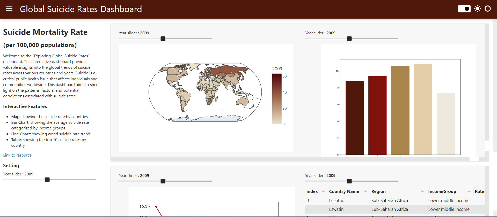

# Suicide-Rate-Dashboard
Dashboard showing the global suicide rate (per 100,000 population) from 2000 to 2019 

### My first handmade project!
The libraries I used:
- matplotlib
- plotly express
- pycountry
- panel
- ipywidgets (just for showing individual interactive)

### The dashdoard includes 4 interactive graphs:

##### *Bar Chart: Visualizing suicide rate categorized by income groups*
##### *Line Chart: Visualizing trend of suicide rate*
##### *Table: Visualizing the top 10 countries with the highest suicide rate by years*
##### *Map: Visualizing the countries with suicide rates*

Link to resource: https://data.worldbank.org/indicator/SH.STA.SUIC.P5?end=2019&name_desc=false&start=2019&type=shaded&view=map&year=2019
